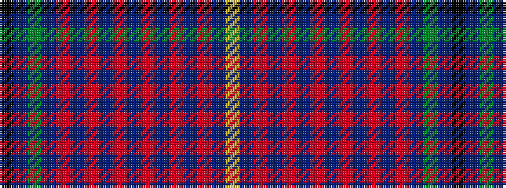

KBGBRBRBRBRBRBRBY

It is a 17 stripe tartan.

<figure class="pat-woven">

<figcaption>idealised sample</figcaption>
</figure>

## Colour Sequence



## Tartans with this colour sequence

| Tartans |
|---------------|
| [Wcwm 9275-1422-1](/variants/s17/k2dp3g2dp3ri2dp3ri2dp14r2db2r2db2r2db2r2dp20lo2~x2/)|
||
