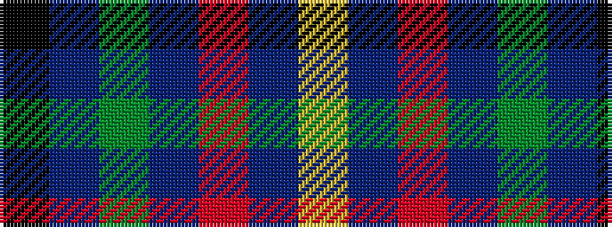

KBGBRBY

It is a 7 stripe tartan.

<figure class="pat-woven">

<figcaption>idealised sample</figcaption>
</figure>

## Colour Sequence



## Tartans with this colour sequence

| Tartans |
|---------------|
| [Blackdown Hills (Corporate)](/variants/s7/k4dt4dy1dt4r4db4lr1~x8/)|
||
