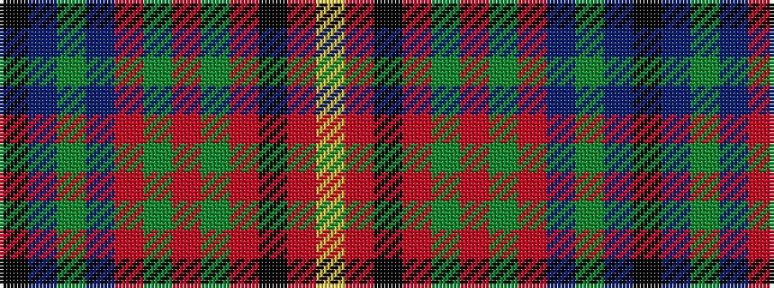

KBGBRGRGRKRY

It is a 12 stripe tartan.

<figure class="pat-woven">

<figcaption>idealised sample</figcaption>
</figure>

## Colour Sequence



## Tartans with this colour sequence

| Tartans |
|---------------|
| [Harris, Jeffrey S (Personal)](/setts/s12/k2db2g2db22r4g3r3g2r22k2r2ly2~x2/)|
||
