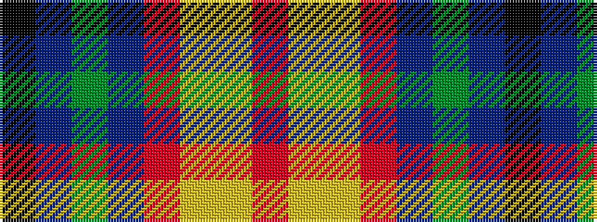

KBGBRYYR

It is a 8 stripe tartan.

<figure class="pat-woven">

<figcaption>idealised sample</figcaption>
</figure>

## Colour Sequence



## Tartans with this colour sequence

| Tartans |
|---------------|
| [Young Family Tartan](/variants/s8/k3dbi3g15db15m5lo3ly2m1~x2/)|
||
