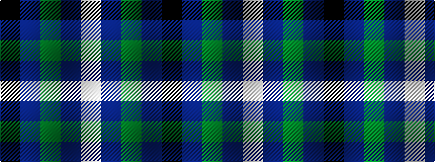

KBGBW

It is a 5 stripe tartan.

<figure class="pat-woven">

<figcaption>idealised sample</figcaption>
</figure>

## Colour Sequence



## Tartans with this colour sequence

This pattern is a design lineage: every tartan below shares one colour order, whatever its owner —
near-identical designs are grouped, the largest lineage first (#112: the pattern is a tartan's
second parent, beside its family or clan).

<table class="sett-table">
<tbody>
<tr><td><a href="/variants/s5/k4t2g13db13w2~x4/">Bath</a></td></tr>
<tr><td class="sett-swatch"></td></tr>
<tr><td><a href="/variants/s5/k3db3g23db21w2~x2~db1406275/">Douglas Clan Tartan</a></td></tr>
<tr><td class="sett-swatch"></td></tr>
<tr><td><a href="/variants/s5/k1dbi1g8db8w1~x4~dbi1406275-db1204274/">Douglas, Green (Wilsons)</a></td></tr>
<tr><td class="sett-swatch"></td></tr>
<tr><td><a href="/variants/s5/k7dr3g30db28lb3~x2/">Highlander Highland Laddie</a></td></tr>
<tr><td class="sett-swatch"></td></tr>
<tr><td><a href="/variants/s5/k7dr3g29db29w3~x2/">Highlander, Highland Laddie Kilts</a></td></tr>
<tr><td class="sett-swatch"></td></tr>
</tbody>
</table>

