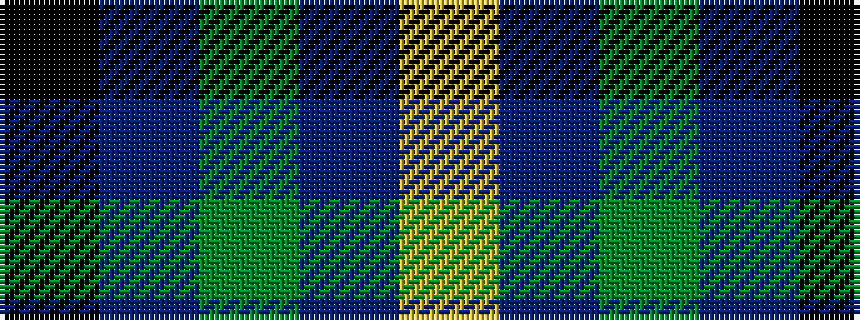

KBGBY

It is a 5 stripe tartan.

<figure class="pat-woven">

<figcaption>idealised sample</figcaption>
</figure>

## Colour Sequence



## Tartans with this colour sequence

| Tartans |
|---------------|
| [Douglas](/tartans/k2b2dg8db8lr1/)|
||
| [Dougles Green](/tartans/k4b2dg8db8lr1/)|
||
| [Wilson's, No 176](/setts/s5/k4t3g12p13ly2~x2/)|
||
