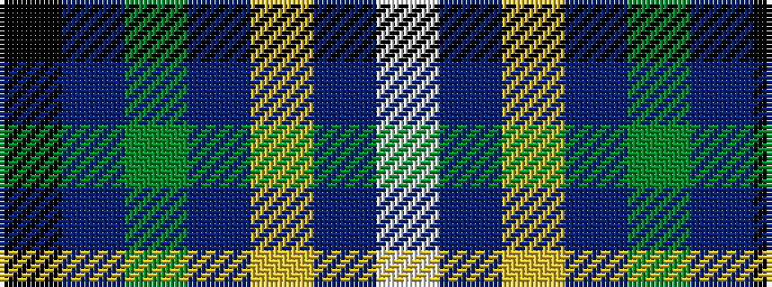

KBGBYBW

It is a 7 stripe tartan.

<figure class="pat-woven">

<figcaption>idealised sample</figcaption>
</figure>

## Colour Sequence



## Tartans with this colour sequence

| Tartans |
|---------------|
| [Wishart Htg (Clan)](/setts/s7/k7db4dg31db3ly2db27lb4~x2/)|
||
| [Wishart, hunting](/setts/s7/k2db2g16db2ly1db13w2~x2/)|
||
