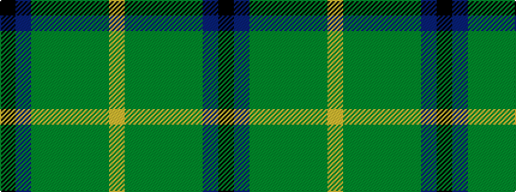

KBGGGGGY

It is a 8 stripe tartan.

<figure class="pat-woven">

<figcaption>idealised sample</figcaption>
</figure>

## Colour Sequence



## Tartans with this colour sequence

| Tartans |
|---------------|
| [Brocliande (Fashion))](/setts/s8/k3t11y15dgi5y10dg14dgi14lo2~x2/)|
||
