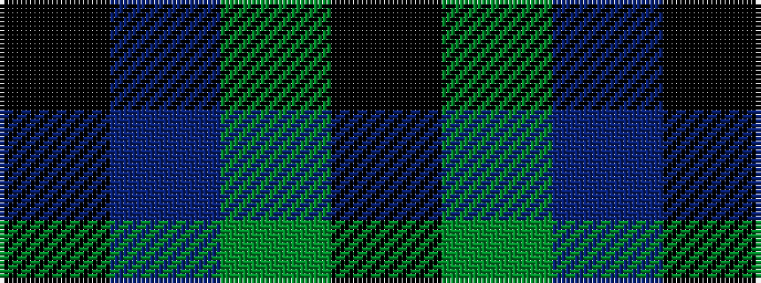

KBGK

It is a 4 stripe tartan.

<figure class="pat-woven">

<figcaption>idealised sample</figcaption>
</figure>

## Colour Sequence



## Tartans with this colour sequence

| Tartans |
|---------------|
| [Innes (Miniature)](/variants/s4/k6t1dg7k1~x2/)|
||
| [Innes, hunting](/variants/s4/k30db7g36k5~x2/)|
||
