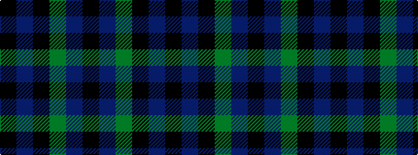

KBGKBK

It is a 6 stripe tartan.

<figure class="pat-woven">

<figcaption>idealised sample</figcaption>
</figure>

## Colour Sequence



## Tartans with this colour sequence

| Tartans |
|---------------|
| [Vance (Family Association) Corporate Family Tartan](/variants/s6/k4t24k2g13t2ki3~x4/)|
||
| [Wilson's, No 167](/variants/s6/k20t2k6g16p4k9~x2/)|
||
