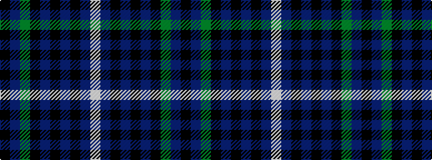

KBGKBKBKBW

It is a 10 stripe tartan.

<figure class="pat-woven">

<figcaption>idealised sample</figcaption>
</figure>

## Colour Sequence



## Tartans with this colour sequence

| Tartans |
|---------------|
| [Dollar Academy, The](/variants/s10/w4db52k12db12k12db12k12dg24db8k1~x2/)|
||
