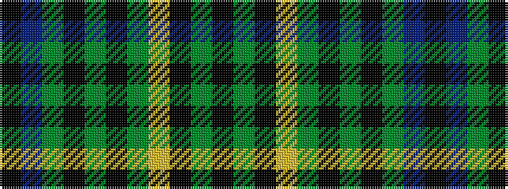

KBGKGKGYKGK

It is a 11 stripe tartan.

<figure class="pat-woven">

<figcaption>idealised sample</figcaption>
</figure>

## Colour Sequence



## Tartans with this colour sequence

| Tartans |
|---------------|
| [Chakraa (Fashion)](/variants/s11/k7t38g7k2g7k2g7lo21k3g4k3~x2/)|
||
