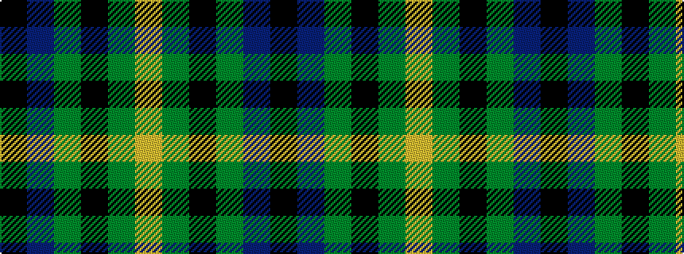

KBGKGY

It is a 6 stripe tartan.

<figure class="pat-woven">

<figcaption>idealised sample</figcaption>
</figure>

## Colour Sequence



## Tartans with this colour sequence

| Tartans |
|---------------|
| [Michaluk (Personal)](/variants/s6/k3b4g20k20g3lo3~x4/)|
||
