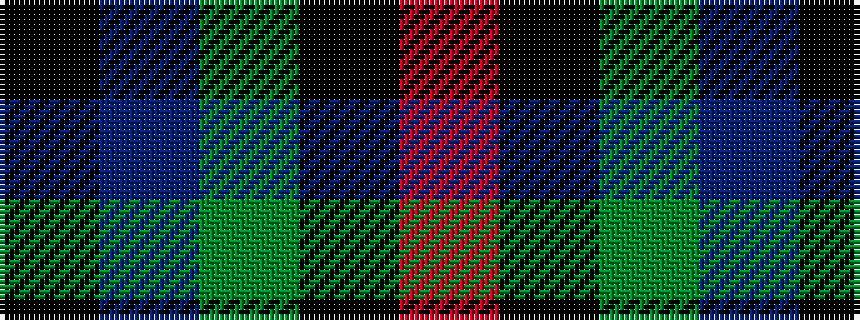

KBGKR

It is a 5 stripe tartan.

<figure class="pat-woven">

<figcaption>idealised sample</figcaption>
</figure>

## Colour Sequence



## Tartans with this colour sequence

| Tartans |
|---------------|
| [Douglas, (Black)](/setts/s5/k12db3g23k23r3~x2/)|
||
| [Douglas, Black](/setts/s5/k8b5g44k40r6/)|
||
