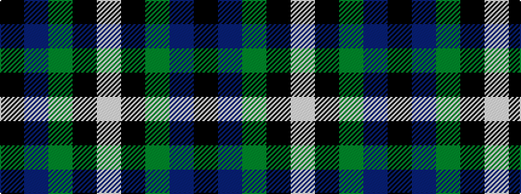

KBGKW

It is a 5 stripe tartan.

<figure class="pat-woven">

<figcaption>idealised sample</figcaption>
</figure>

## Colour Sequence



## Tartans with this colour sequence

| Tartans |
|---------------|
| [Douglas (Clan)](/variants/s5/k6db4dg44k41w4~x2/)|
||
| [Douglas (alternative threadcount)](/variants/s5/k6db4g44k41w4~x2/)|
||
