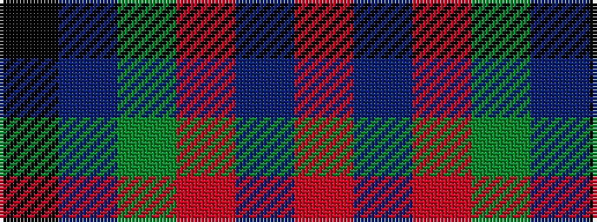

KBGRBR

It is a 6 stripe tartan.

<figure class="pat-woven">

<figcaption>idealised sample</figcaption>
</figure>

## Colour Sequence



## Tartans with this colour sequence

| Tartans |
|---------------|
| [MacPhail](/setts/s6/r25db7r3g13t1k2~x4/)|
||
| [MacPhail (Blue Bands)](/setts/s6/r40b8r6g24t1k4~x2/)|
||
