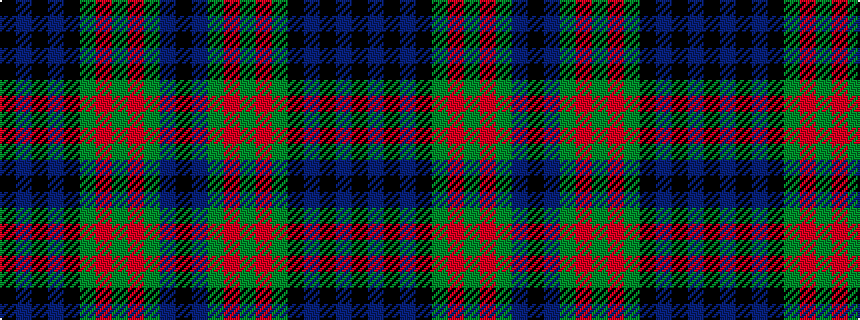

KBGRGRGKBKBK

It is a 12 stripe tartan.

<figure class="pat-woven">

<figcaption>idealised sample</figcaption>
</figure>

## Colour Sequence



## Tartans with this colour sequence

| Tartans |
|---------------|
| [Jedforest](/variants/s12/k4db2g24r1g2r1g2k20db24k1db2k4~x2/)|
||
