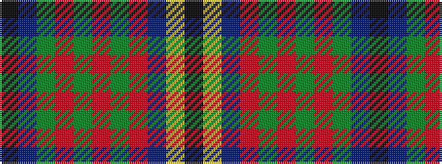

KBGRGRGRBYK

It is a 11 stripe tartan.

<figure class="pat-woven">

<figcaption>idealised sample</figcaption>
</figure>

## Colour Sequence



## Tartans with this colour sequence

| Tartans |
|---------------|
| [Polkemmet (Corporate)](/variants/s11/k7lo3db62o16g5o5g5o5g16db16k4/)|
||
