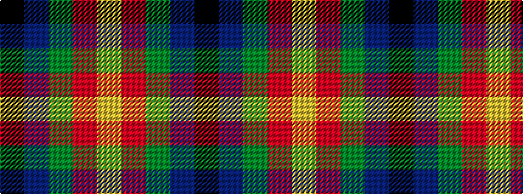

KBGRY

It is a 5 stripe tartan.

<figure class="pat-woven">

<figcaption>idealised sample</figcaption>
</figure>

## Colour Sequence



## Tartans with this colour sequence

| Tartans |
|---------------|
| [Douglas of Roxburgh](/variants/s5/k6db3dg20r20ly3~x2/)|
||
| [Turnbull Dress](/variants/s5/k2db1g10r10ly1~x6/)|
||
| [Turnbull, dress](/variants/s5/k7db3g28r28ly3~x2/)|
||
