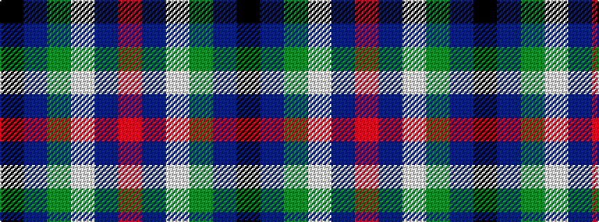

KBGWBR

It is a 6 stripe tartan.

<figure class="pat-woven">

<figcaption>idealised sample</figcaption>
</figure>

## Colour Sequence



## Tartans with this colour sequence

| Tartans |
|---------------|
| [Vance](/variants/s6/k3t2g13w2t24r3~x4/)|
||
| [Vance (Family Association)](/variants/s6/r4db24w2g13db2k3~x4/)|
||
