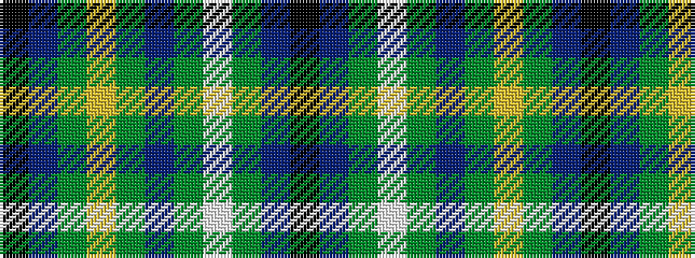

KBGWGBGYGBK

It is a 11 stripe tartan.

<figure class="pat-woven">

<figcaption>idealised sample</figcaption>
</figure>

## Colour Sequence



## Tartans with this colour sequence

| Tartans |
|---------------|
| [Chapman-Smith, M & L (Personal)](/setts/s11/k2db4g27lo2g1dp4g1lt2g27db4k2~x2/)|
||
