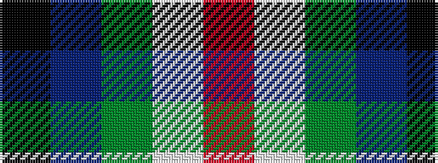

KBGWR

It is a 5 stripe tartan.

<figure class="pat-woven">

<figcaption>idealised sample</figcaption>
</figure>

## Colour Sequence



## Tartans with this colour sequence

| Tartans |
|---------------|
| [Cleland](/variants/s5/k2n36g12w3r2~x2/)|
||
| [Cleland](/variants/s5/k2db36g12w3r2~x2/)|
||
| [Cleland (Name)](/variants/s5/k2t36dg12w3r2~x2/)|
||
| [Cleland Corporate Tartan](/variants/s5/k2t28g7w3r2~x2/)|
||
