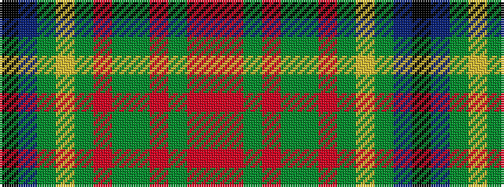

KBGYGRGGRGRR

It is a 12 stripe tartan.

<figure class="pat-woven">

<figcaption>idealised sample</figcaption>
</figure>

## Colour Sequence



## Tartans with this colour sequence

| Tartans |
|---------------|
| [GRM (Fashion)](/setts/s12/k39b3dy8lo2dy2r2dy2dg8ri5dy2ri3r2~x2/)|
||
