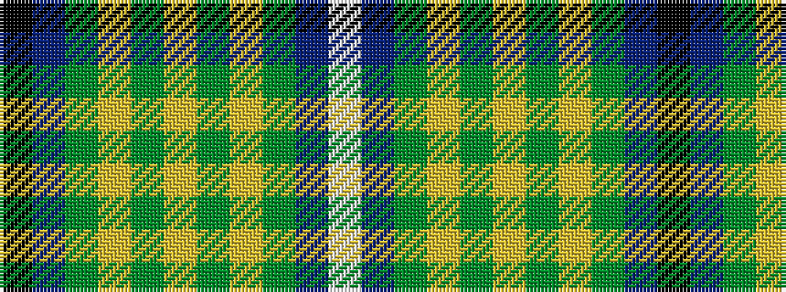

KBGYGYGYGBW

It is a 11 stripe tartan.

<figure class="pat-woven">

<figcaption>idealised sample</figcaption>
</figure>

## Colour Sequence



## Tartans with this colour sequence

| Tartans |
|---------------|
| [William & Mary GALA (Corporate)](/variants/s11/k3db10dg25ly2dg2ly3dg2ly2dg25db10w3~x2/)|
||
| [William and Mary GALA, Inc, The](/variants/s11/k3b10g25ly2g2ly3g2ly2g25b10w3~x2/)|
||
