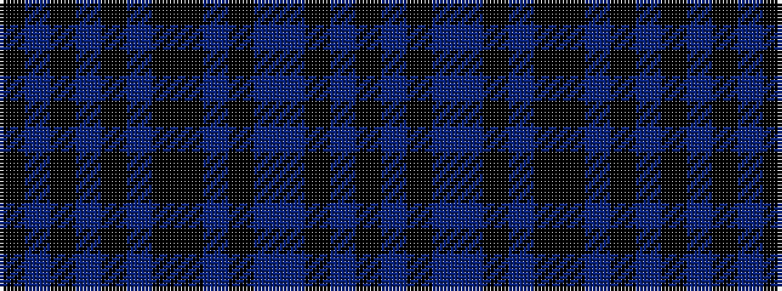

KBKBBKBKKBKBKBK

It is a 15 stripe tartan.

<figure class="pat-woven">

<figcaption>idealised sample</figcaption>
</figure>

## Colour Sequence



## Tartans with this colour sequence

| Tartans |
|---------------|
| [GOLF (Wonderland Publications)](/setts/s15/k15dp2k1dr1n1k15dr1k2k15n1k15dp4k2n1k15~x2/)|
||
