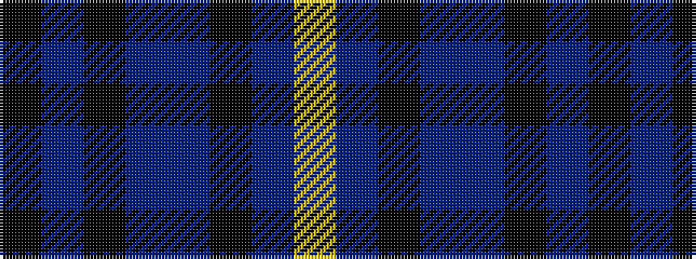

KBKBBKBY

It is a 8 stripe tartan.

<figure class="pat-woven">

<figcaption>idealised sample</figcaption>
</figure>

## Colour Sequence



## Tartans with this colour sequence

| Tartans |
|---------------|
| [Granite City (Fashion)](/variants/s8/k3n3k3n21ni21k3ni3lr1~x2/)|
||
