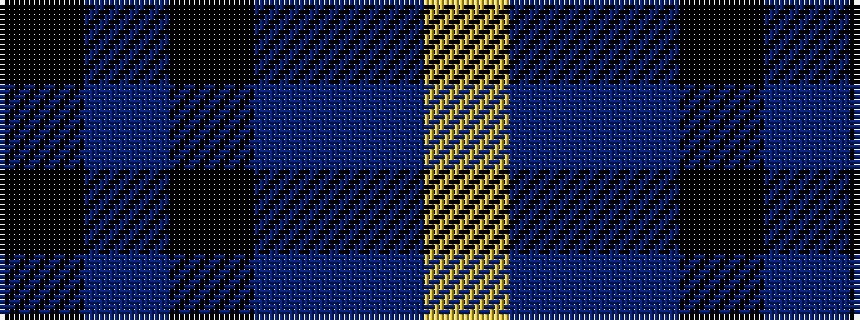

KBKBBY

It is a 6 stripe tartan.

<figure class="pat-woven">

<figcaption>idealised sample</figcaption>
</figure>

## Colour Sequence



## Tartans with this colour sequence

| Tartans |
|---------------|
| [Connecticut State Police Pipe Band](/setts/s6/k42n2k2n17db8lo4~x2/)|
||
