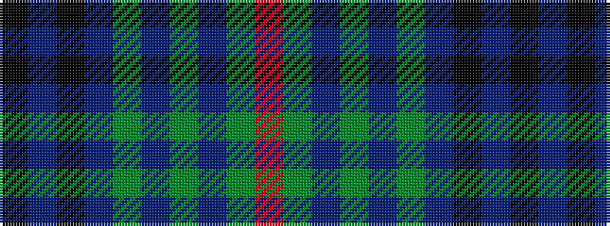

KBKBGBGBGR

It is a 10 stripe tartan.

<figure class="pat-woven">

<figcaption>idealised sample</figcaption>
</figure>

## Colour Sequence



## Tartans with this colour sequence

| Tartans |
|---------------|
| [Nichol (Personal)](/setts/s10/k1db5k4db1dg1db1dg4db5dg1r1~x6/)|
||
