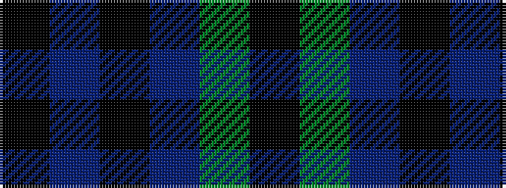

KBKBGK

It is a 6 stripe tartan.

<figure class="pat-woven">

<figcaption>idealised sample</figcaption>
</figure>

## Colour Sequence



## Tartans with this colour sequence

| Tartans |
|---------------|
| [Campbell, Sir Walter Scott](/variants/s6/k2g8db2k9p7k2~x2/)|
||
| [Campbell, Sir Walter Scott](/variants/s6/k2dg8db2k9dp7k2~x2/)|
||
| [Granger Family Tartan](/variants/s6/k40dt4k12dt21g17k4~x2/)|
||
| [Scott, Sir Walter](/variants/s6/k3g9t2k11p9k3~x2/)|
||
| [Scottish Football Association (Corp)](/variants/s6/k120db4k12dt36dg3k6/)|
||
