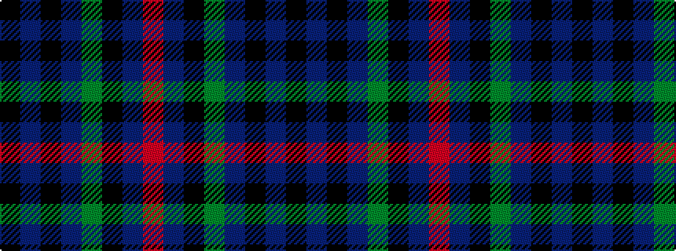

KBKBGKBR

It is a 8 stripe tartan.

<figure class="pat-woven">

<figcaption>idealised sample</figcaption>
</figure>

## Colour Sequence



## Tartans with this colour sequence

| Tartans |
|---------------|
| [Scottish Heritage](/setts/s8/k2dbi6k1db7dg13k11db42r2~x2/)|
||
