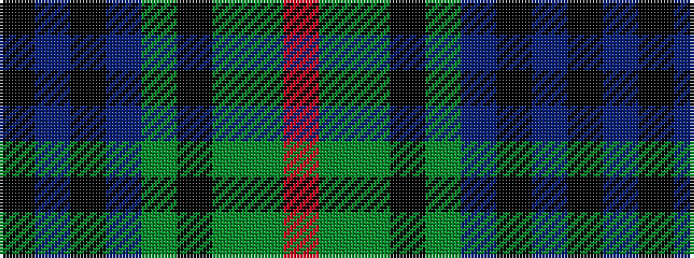

KBKBGKGGR

It is a 9 stripe tartan.

<figure class="pat-woven">

<figcaption>idealised sample</figcaption>
</figure>

## Colour Sequence



## Tartans with this colour sequence

| Tartans |
|---------------|
| [Pro Simon](/setts/s9/k2db2k2db17dg10k2dg2g13o2~x2/)|
||
