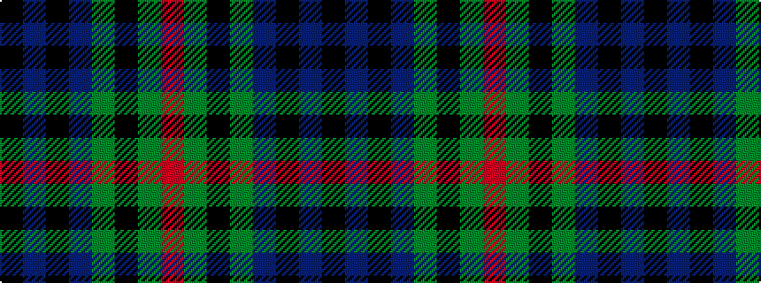

KBKBGKGR

It is a 8 stripe tartan.

<figure class="pat-woven">

<figcaption>idealised sample</figcaption>
</figure>

## Colour Sequence



## Tartans with this colour sequence

| Tartans |
|---------------|
| [Peter of Lee](/variants/s8/r4dg3k2dg38db30k3db3k3~x2/)|
||
| [Peter of Lee (Personal)](/variants/s8/r3g1k1g12b12k1b1k1~x4/)|
||
