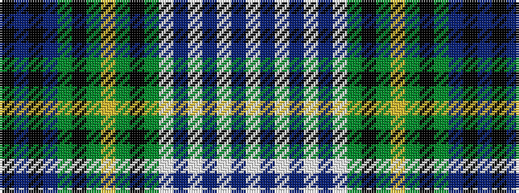

KBKBGKGYGKGWBWBWBW

It is a 18 stripe tartan.

<figure class="pat-woven">

<figcaption>idealised sample</figcaption>
</figure>

## Colour Sequence



## Tartans with this colour sequence

| Tartans |
|---------------|
| [Johnston Dress (Clan?)](/setts/s18/k3db3k3db18g20k3g3ly3g3k3g20lb3db3lb3db3lb12db3lb3~x2/)|
||
