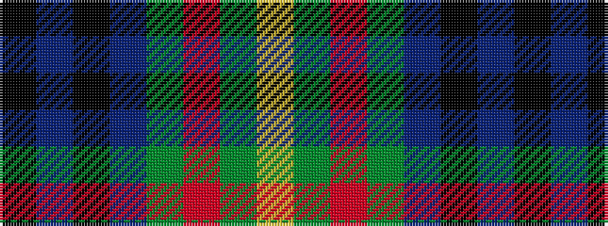

KBKBGRGY

It is a 8 stripe tartan.

<figure class="pat-woven">

<figcaption>idealised sample</figcaption>
</figure>

## Colour Sequence



## Tartans with this colour sequence

| Tartans |
|---------------|
| [Chartered Accountants of Scotland](/variants/s8/ly4g3r2g36b30k3b3k3~x2/)|
||
