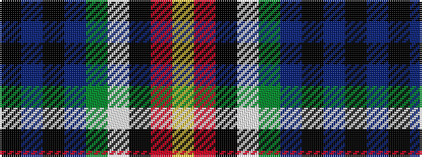

KBKBGWKRY

It is a 9 stripe tartan.

<figure class="pat-woven">

<figcaption>idealised sample</figcaption>
</figure>

## Colour Sequence



## Tartans with this colour sequence

| Tartans |
|---------------|
| [Teall of Teallach](/variants/s9/k2t6k1db7dg13w1k11r14ly2~x2/)|
||
| [Teall of Teallach (Personal)](/variants/s9/k2t6k1db7g13w1k11r14ly2~x2/)|
||
