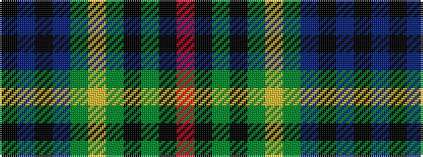

KBKBGYGKGKR

It is a 11 stripe tartan.

<figure class="pat-woven">

<figcaption>idealised sample</figcaption>
</figure>

## Colour Sequence



## Tartans with this colour sequence

| Tartans |
|---------------|
| [Dama Weekend](/setts/s11/ki42n2ki2n4y4ly2y6k9y2k2r2~x2/)|
||
