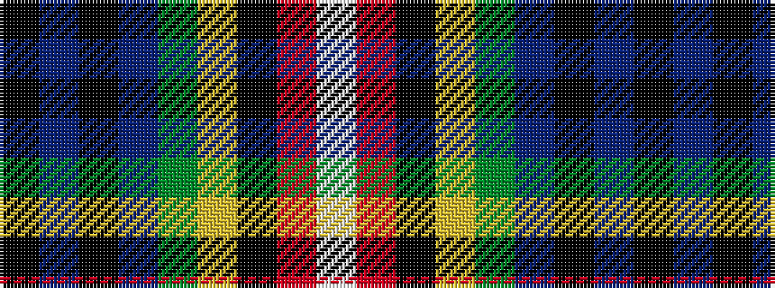

KBKBGYKRW

It is a 9 stripe tartan.

<figure class="pat-woven">

<figcaption>idealised sample</figcaption>
</figure>

## Colour Sequence



## Tartans with this colour sequence

| Tartans |
|---------------|
| [McCuaig (Glenelg and the Western Isles) Hunting](/setts/s9/k20db2k2db4dg4ly2k40r2w3~x2/)|
||
