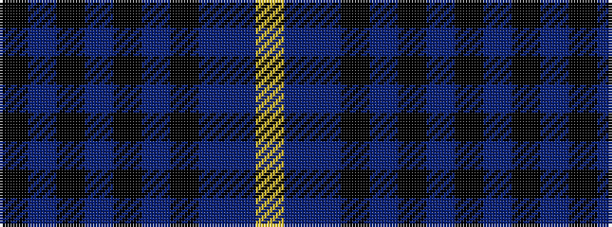

KBKBKBKBBY

It is a 10 stripe tartan.

<figure class="pat-woven">

<figcaption>idealised sample</figcaption>
</figure>

## Colour Sequence



## Tartans with this colour sequence

| Tartans |
|---------------|
| [Hannay Blue (Fashion?)](/setts/s10/k9t4k2t4k2t30k9t4db14ly2~x2/)|
||
