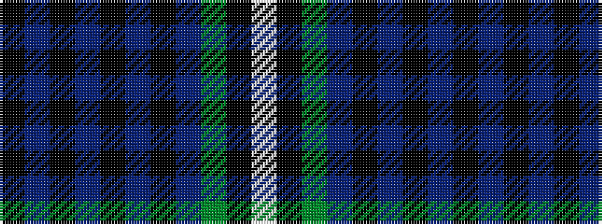

KBKBKBKBGKW

It is a 11 stripe tartan.

<figure class="pat-woven">

<figcaption>idealised sample</figcaption>
</figure>

## Colour Sequence



## Tartans with this colour sequence

| Tartans |
|---------------|
| [Royal Highland Yacht Club](/setts/s11/k26db3k1dp2k1db3k3db12dg14k2w2~x2/)|
||
