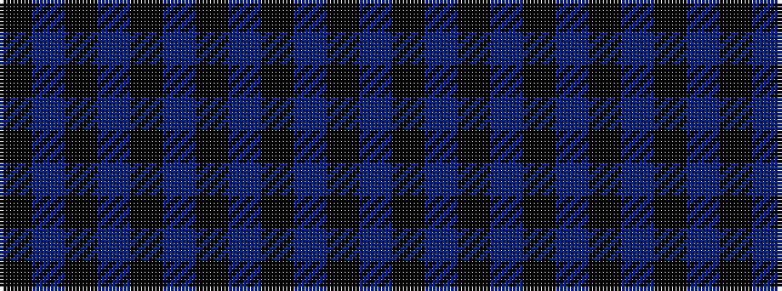

KBKBKBKBKBK

It is a 11 stripe tartan.

<figure class="pat-woven">

<figcaption>idealised sample</figcaption>
</figure>

## Colour Sequence



## Tartans with this colour sequence

| Tartans |
|---------------|
| [Azabu Tailor](/setts/s11/k17db39k20db4k2db3k4db3k2db4k3~x4/)|
||
| [Azabu Tailor (Corporate)](/setts/s11/k66db155k80db16k8db12k16db12k8db16k12/)|
||
| [Grey Pride of Scotland (Fashion)](/setts/s11/k8n2k2n2k14n2k2n1k14n26k2~x2/)|
||
