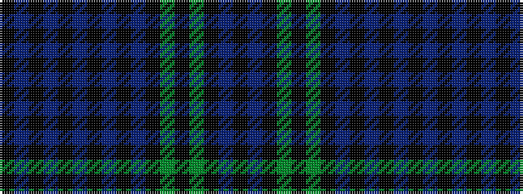

KBKBKBKBKBKGKGKBK

It is a 17 stripe tartan.

<figure class="pat-woven">

<figcaption>idealised sample</figcaption>
</figure>

## Colour Sequence



## Tartans with this colour sequence

| Tartans |
|---------------|
| [Dickie (Glasgow)](/setts/s17/k5db1k1n1k3n1k1db1k3db1k1g1k16g1k1n1k2~x4/)|
||
| [Dickie (Glasgow) (Personal)](/setts/s17/k5dt1k1n1k3n1k1dt1k3dt1k1dg1k16dg1k1n1k2~x4/)|
||
