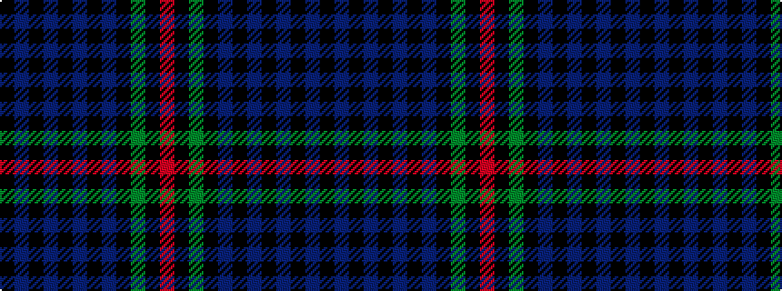

KBKBKBKBKGKR

It is a 12 stripe tartan.

<figure class="pat-woven">

<figcaption>idealised sample</figcaption>
</figure>

## Colour Sequence



## Tartans with this colour sequence

| Tartans |
|---------------|
| [Brown Ellis (Personal)](/setts/s12/k4dbi11k1dbi2k1dbi11k2db14k2dg14k1r2~x2/)|
||
| [Brown Ellis (Personal)](/setts/s12/k2b11k1b2k1b11k2db14k2g14k1r2~x2/)|
||
