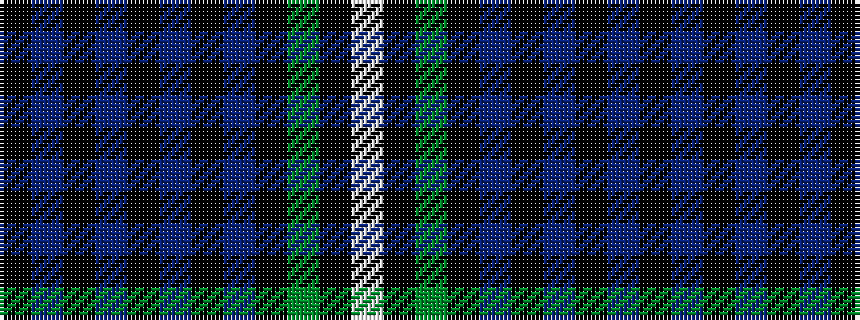

KBKBKBKBKGKW

It is a 12 stripe tartan.

<figure class="pat-woven">

<figcaption>idealised sample</figcaption>
</figure>

## Colour Sequence



## Tartans with this colour sequence

| Tartans |
|---------------|
| [Ellis (Welsh Name)](/variants/s12/k4t26k2t4k2t26k3dt36k3g30k3w2/)|
||
