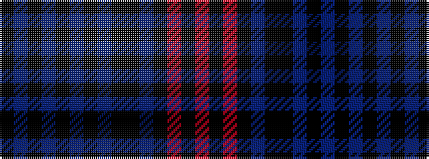

KBKBKBKBKKBKRKR

It is a 15 stripe tartan.

<figure class="pat-woven">

<figcaption>idealised sample</figcaption>
</figure>

## Colour Sequence



## Tartans with this colour sequence

| Tartans |
|---------------|
| [Lochcarron Mill (Corporate)](/setts/s15/k2do6k2do1k2do1k2do4k4k2do4k19r2k2r2~x4/)|
||
