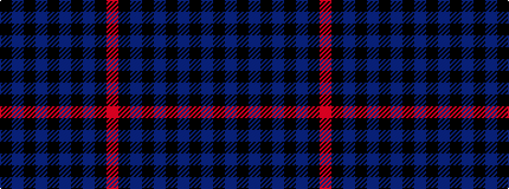

KBKBKBKBKR

It is a 10 stripe tartan.

<figure class="pat-woven">

<figcaption>idealised sample</figcaption>
</figure>

## Colour Sequence



## Tartans with this colour sequence

| Tartans |
|---------------|
| [Slanj](/variants/s10/k28b3k3b25k3b25k3b3k28m4~x2/)|
||
| [Witches' Blood, The](/variants/s10/k22n17k2n4k2n2k37n4k2r3~x2/)|
||
