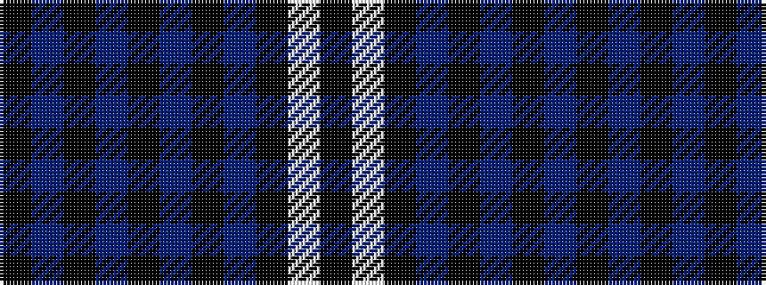

KBKBKBKBKWK

It is a 11 stripe tartan.

<figure class="pat-woven">

<figcaption>idealised sample</figcaption>
</figure>

## Colour Sequence



## Tartans with this colour sequence

| Tartans |
|---------------|
| [Stewart Mourning (Clan)](/setts/s11/k40n3k5n2k2n2k2n6k4w2k4~x2/)|
||
