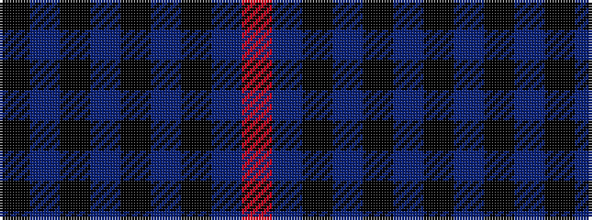

KBKBKBKBR

It is a 9 stripe tartan.

<figure class="pat-woven">

<figcaption>idealised sample</figcaption>
</figure>

## Colour Sequence



## Tartans with this colour sequence

| Tartans |
|---------------|
| [USCBP - Office of Field Operations](/setts/s9/k6db3k3db33k16b21k3b3r4~x2/)|
||
