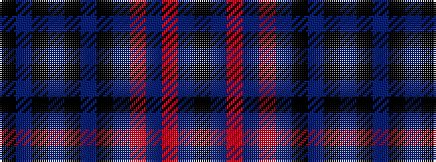

KBKBKBKBRBRBK

It is a 13 stripe tartan.

<figure class="pat-woven">

<figcaption>idealised sample</figcaption>
</figure>

## Colour Sequence



## Tartans with this colour sequence

| Tartans |
|---------------|
| [Yarrow Purple Dress Tartan Tartan Number: 8178. Earliest known date: See products available Copyright © Blair Urquhart, Comrie, 2015](/setts/s13/k2dp4m2dp24m3dp3ki9dp2k27dp2k2dp2ki2~x2/)|
||
