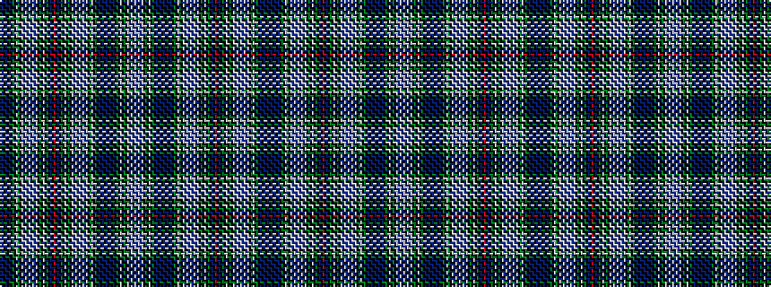

KBKBKBKGKWGKWBWBWBWBWKGKWKGKBKRKBKGKWKGKWBWBWBWBWKGWKGKBKBKBKBKBKGKWKGKWBWBW

It is a 76 stripe tartan.

<figure class="pat-woven">

<figcaption>idealised sample</figcaption>
</figure>

## Colour Sequence



## Tartans with this colour sequence

This pattern is a design lineage: every tartan below shares one colour order, whatever its owner —
near-identical designs are grouped, the largest lineage first (#112: the pattern is a tartan's
second parent, beside its family or clan).

<table class="sett-table">
<tbody>
<tr><td><a href="/variants/s76/w3t2w14t3w3k5dg12k1w3k1dg12k12t2k2t2k2t12k2t2k2t2k12dg12k1w3dg12k5w3t3w14t2w3t2w14t3w3k5dg12k1w3k1dg12k12t12k1r3k1t12k12dg12k1w3k1dg12k5w3t3w14t2w3t2w14t3w3k5dg12w3k1dg12k14t2k2t12k2t2k2~x2/">Kilbarchan Unidentified No. 14</a></td></tr>
<tr><td class="sett-swatch"></td></tr>
</tbody>
</table>

