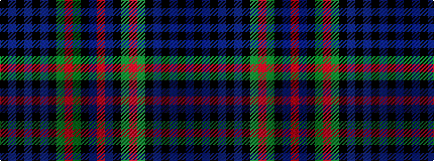

KBKBKBKGRGKBR

It is a 13 stripe tartan.

<figure class="pat-woven">

<figcaption>idealised sample</figcaption>
</figure>

## Colour Sequence



## Tartans with this colour sequence

| Tartans |
|---------------|
| [Blairgowrie High School (SA)](/variants/s13/r3b10k10dg10r3dg10k10b2k2b2k2b5k2~x4/)|
||
| [Blairgowrie High School S.A. (Corp)](/variants/s13/r3b10k10g10r3g10k10b2k2b2k2b5k2~x2/)|
||
